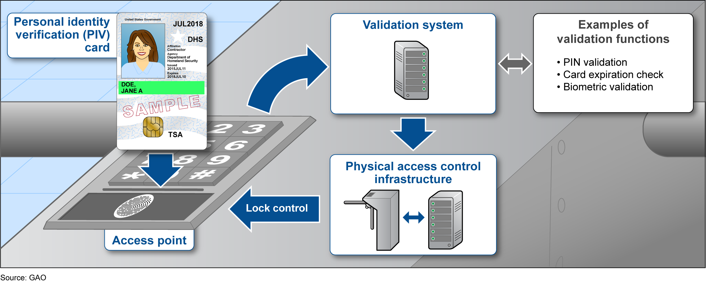

Physical Access Control Systems (PACSs) today are far more sophisticated than those of any previous generation. Yet, the key limitation of a *standalone PACS* hasn't changed - it controls physical access for only one site. The majority of federal agencies use standalone PACSs.

*Is there a way for agencies to control physical access for most (or all) of their sites?*  Yes - the answer is to implement an *Enterprise Physical Access Control System (E-PACS)*.   

This page will give you a basic understanding of both PACS and E-PACS, some differences between their functions, and the key advantages of using an E-PACS:  

- [What Is a PACS?](#what-is-a-physical-access-control-system)
- [What Is an Enterprise PACS?](#what-is-an-enterprise-pacs)
- [Would an Enterprise PACS Work for Our Agency?](#would-an-enterprise-pacs-work-for-our-agency)

First, let’s talk about PACS. 

## What Is a Physical Access Control System?

An agency's standalone PACS grants access to employees and contractors who work at or visit one site by authenticating their PIV credentials. Each PACS is managed locally by one site and is not connected to the agency’s enterprise network. At a high level, a standalone PACS' operational flow works like this:

{:style="width:90%;float:center"}

The core components that make up both PACS and E-PACS systems are defined below.



| **PACS and E-PACS Components** | **What Is This?** |
|----------------|----------|
| **1. Access point** | Entrance point where an employee or contractor interacts with the PACS (e.g., reader). The access point also involves barriers, such as turnstiles, gates, locking doors, etc. |
| **2. PIV credential** | [Personal Identity Verification (PIV) credentials](https://piv.idmanagement.gov/elements/){:target="_blank"} (i.e., PIV cards) are used by federal employees and contractors to *physically access* federal facilities and *logically access* federal information systems. Employees and contractors must be cleared at the security classification level of the facilities and information systems for which they request access. |
| **3. Reader and keypad** | (Also called *card reader* and *credential reader.*) The reader provides power to and reads data from a PIV credential. The reader also sends this data to a PACS or E-PACS control panel/component (also called *controller* and *panel*) to authenticate the PIV credential and request access authorization. Employees and contractors may need to enter a PIN into the keypad and may need to add a biometric, depending on the facility's security classification and risk levels. | 
| **4. Biometric reader** | Captures biometric data (e.g., fingerprint or iris scan) and verifies it against the PIV credential's biometric data. |
| **5. Control panel/ component** | (Also called *controller* and *panel.*) Receives the credential data sent by the reader and verifies its presence in the data repository. It then makes an access decision and transmits authorization data to the access control server and access point.  |
| **6. Access control server** | Grants authorization to the employee or contractor requesting access (e.g., presenting PIV credential to a reader). It also registers and enrolls employees and contractors; enrolls and validates credentials; and logs system events. |
| **7. Credential- holder data repository** | Contains employee and contractor data and physical access privileges. This authoritative data is used by control panels/components to validate credential data. |

### Some PACS' Operational Challenges

Agencies that use standalone PACS have encountered operational challenges: 
-   Physical access can only be controlled by each site
-	Delays with credential transfers or terminations 
-	Employees and contractors must re-enroll their credentials for all federal work sites and sites that they visit
-	Enterprise-wide security policies are not consistently applied 
-   Highly vulnerable to network-based attacks
-   Reduced situational awareness (i.e., logs cannot be correlated across the enterprise) 
-	Increased human error (data entry, etc.) for an agency with many standalone PACSs

Now, let's take a look at Enterprise PACS.

## What Is an Enterprise PACS?

* An E-PACS resides on an agency’s enterprise network and controls physical access for most (or all) of the agency's sites. 
* Because an E-PACS controls most (or all) physical access, agencies have experienced improved system management, scalability, system performance, monitoring, as well as improved enrollment and throughput speeds for employees and contractors.



## Would an Enterprise PACS Work for Our Agency?

Here are some key E-PACS advantages to consider:

-	One enterprise-wide system controls physical access for many (or all) agency sites
-	One employee and contractor enrollment system (although there may be multiple enrollment locations)
-	One credential registration/provisioning point
-	One enterprise-wide system for modifying or terminating access privileges
-	One enterprise-wide system polls regularly for Certificate Revocation List (CRL) updates and maintains revocation data
-   Reduced costs for system management (patching, server system administration, software updates, etc.) and reporting (Federal Information Security Modernization Act [FISMA] reporting, etc.) 
-   Reduced costs for:
    - Server hardware
    - System security assessment and accreditation

The next section, *[Aligning Facility Security Level (FSL) and Authentication]({{site.baseurl}}/alignfslandauth/)*, explains the processes needed to prepare for an E-PACS deployment.

